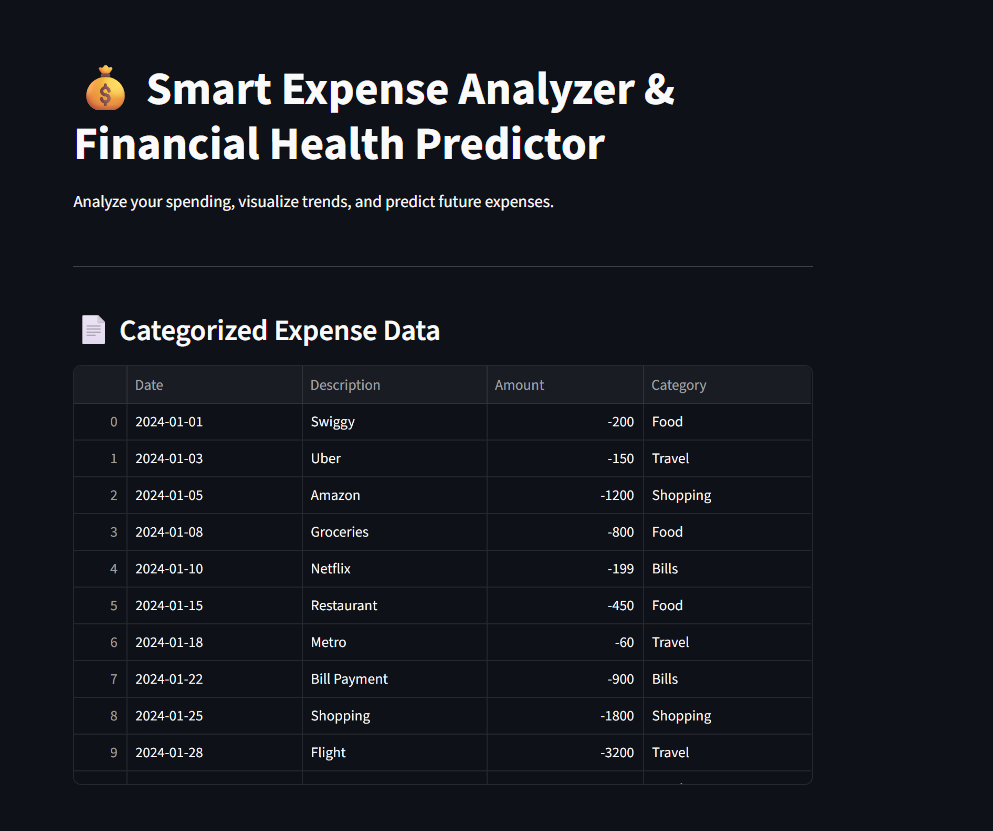
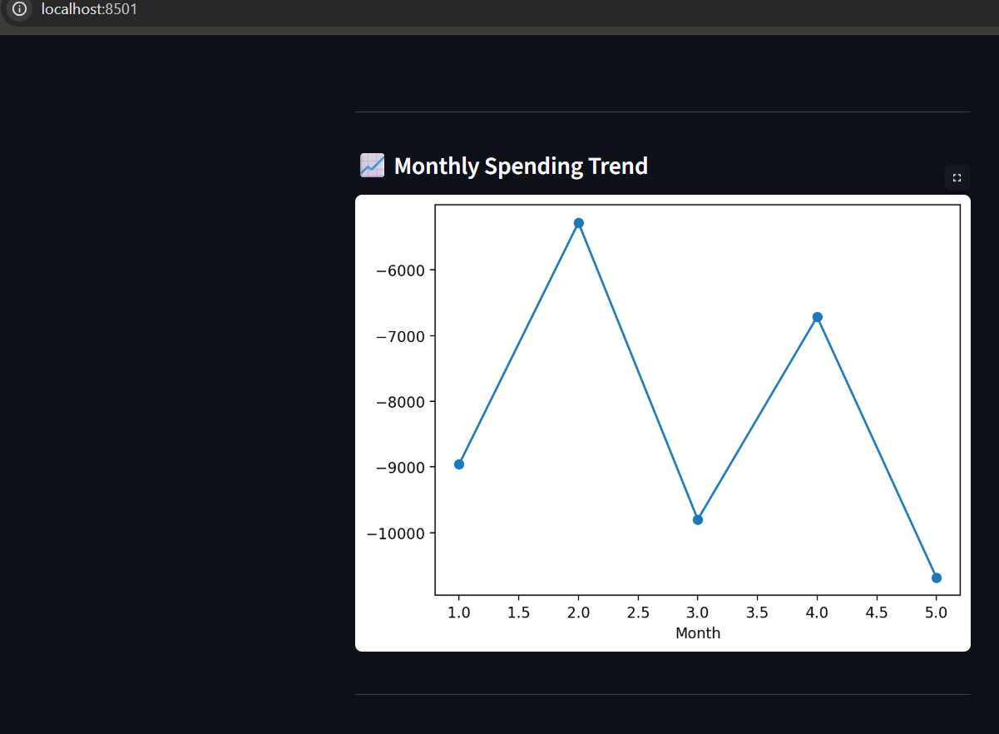
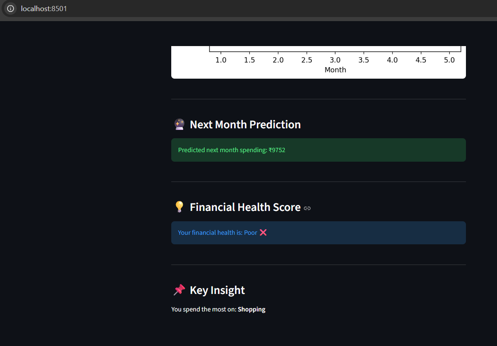

# 💰 Smart Expense Analyzer

I made this project to understand where money actually goes every month.  
Most of the time we spend without thinking, so I wanted something simple that shows it clearly.

---

## 🧠 What this does

- Takes a CSV file with expenses  
- Groups them into categories (food, travel, shopping, etc.)  
- Shows charts so you can see patterns easily  
- Predicts next month’s spending (basic model)  
- Gives a simple idea of your financial health  

---

## 💡 Why I built this

Honestly, I noticed I had no idea where my money was going.  
So instead of just tracking manually, I thought of building a small tool using data.

---

## ⚙️ Tech used

- Python  
- Pandas  
- Matplotlib  
- Scikit-learn  
- Streamlit  

---

## ▶️ How to run

Install libraries:

pip install pandas matplotlib scikit-learn streamlit  

Run:

streamlit run app.py  

---

## 📂 Extra feature

You can upload your own CSV file and check your spending.

---

## 📸 Screenshots

### Dashboard

### Data

### Charts

### Prediction

---

## 🚀 What I can improve later

- Better prediction model  
- Smarter categorization  
- More useful insights  